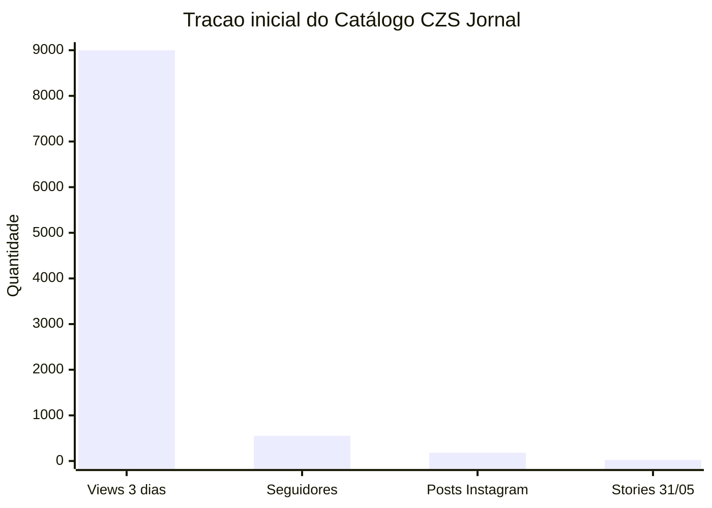
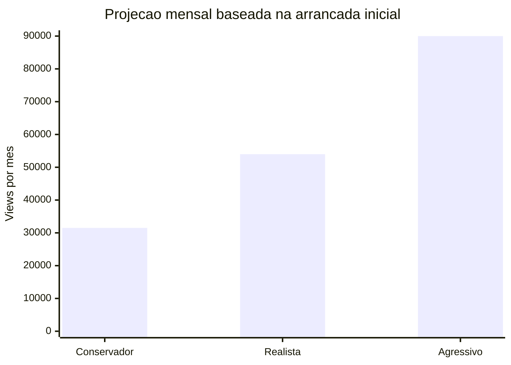
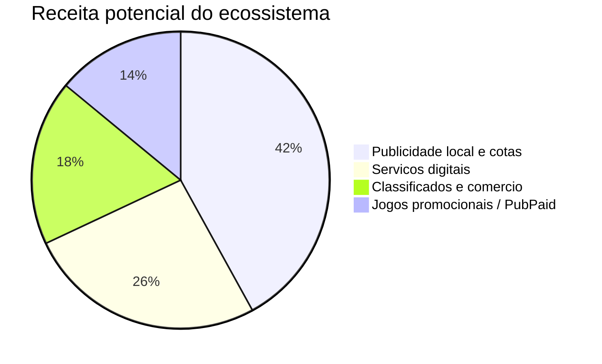

# Catálogo CZS Jornal - Pitch Comercial Para Cotas

Data: 31 de maio de 2026  
Site publico: https://catalogo-cruzeiro-web.onrender.com/  
Instagram: https://www.instagram.com/catalogo_czs_/  
Produto: jornal local digital de Cruzeiro do Sul, Vale do Jurua e Acre

---

## Prompt Operacional Em Ingles Executado

```text
Act as a commercial systems analyst and media salesperson for Catálogo CZS Jornal, the local news website for Cruzeiro do Sul, Vale do Juruá and Acre.

Audit the live Render website, the public Instagram profile, local analytics files, content archive, Instagram posting logs, WhatsApp distribution evidence, current service modules and monetization hooks.

Create a buyer-facing pitch for potential quota/share buyers. Do not weaken the pitch with local/test analytics numbers. Use public online verification for Instagram followers/posts and site availability. Treat private Instagram views as owner-provided operational traction unless an Insights export is attached.

Include projections, pie charts, service inventory, current functions, launch-to-growth narrative, risks, proof checklist and a final sales message.
```

---

## Resumo Executivo

O Catálogo CZS Jornal ja esta no ar como uma midia local digital para Cruzeiro do Sul, Vale do Jurua e Acre. O produto combina jornal, Instagram, WhatsApp, arquivo de noticias, servicos comerciais, classificados, publicidade local e tecnologia propria de analytics.

O ponto central para vender cotas e este: o projeto nao esta no papel. Ele tem site publico, perfil social ativo, quase 600 seguidores verificados, mais de 180 posts no Instagram, arquivo com 480 noticias e uma janela inicial informada de aproximadamente 9.000 views em 3 dias de ativacao.

---

## Numeros Fortes Para Apresentar

| Indicador | Numero | Tipo de prova |
| --- | ---: | --- |
| Site publico no Render | 200 OK | verificado online |
| Seguidores no Instagram | 552 | verificado online |
| Seguindo no Instagram | 1.137 | verificado online |
| Posts no Instagram | 181 | verificado online |
| Views em aproximadamente 3 dias | 9.000 | dado operacional informado; anexar print do Insights |
| Noticias no arquivo local | 480 | verificado no projeto |
| Modulos de servicos/utilidade | 12 | verificado no projeto |
| Itens/listagens de servicos | 49 | verificado no projeto |
| Posts de feed publicados em 31/05 | 24 | log operacional |
| Stories de noticias em 31/05 | 12 | log operacional |
| Stories comerciais em 31/05 | 11 | log operacional |

> Leitura para o comprador: a cota entra em uma operacao pos-lancamento, com produto aberto, canais ativos, conteudo publicado e inventario comercial pronto para vender patrocinio local.

---

## Funcionou Apos O Lancamento

| Prova pos-lancamento | Resultado | O que isso vende |
| --- | --- | --- |
| Site publico no Render | online e respondendo 200 OK | produto real, acessivel e apresentavel para anunciantes |
| Instagram publico | 552 seguidores, 1.137 seguindo e 181 posts | canal social ja aquecido para distribuicao e prova visual |
| Arrancada de alcance | 9.000 views informadas em aproximadamente 3 dias | sinal de demanda por noticia local e conteudo regional |
| Rodada operacional de 31/05 | 24 posts de feed, 12 stories de noticias e 11 stories comerciais | capacidade de producao e entrega diaria |
| Inventario comercial | 12 modulos e 49 itens/listagens de servicos | monetizacao alem do jornal: anuncios, guias, servicos e parcerias |

---

## Mercado Regional Imediato

O ativo nasce no segundo polo urbano do Acre e mira uma regiao onde comercio, politica, seguranca, saude, servicos e utilidade publica circulam diariamente por grupos e redes sociais. Cruzeiro do Sul tem escala municipal de quase 100 mil habitantes nas referencias populacionais recentes, e o Vale do Jurua concentra cidades conectadas por demanda de noticia, servico, venda e deslocamento.

| Sinal de mercado | Valor comercial |
| --- | --- |
| Escala de Cruzeiro do Sul | quase 100 mil habitantes nas bases IBGE recentes |
| Segundo polo acreano | relevancia regional fora da capital |
| Vale do Jurua | audiencia natural em cidades conectadas por noticia e servico |
| Anunciante local | compra proximidade e conversao, nao audiencia anonima |

---

## Projecao De Crescimento

Base informada: 9.000 views em 3 dias, ritmo bruto de 3.000 views/dia.

| Cenario | Premissa | Views/mês projetadas | Seguidores em 30 dias | Leitura comercial |
| --- | --- | ---: | ---: | --- |
| Conservador | 35% do ritmo inicial de views e 25% do ritmo inicial de seguidores | 31.500 | aprox. 1.930 | sustenta cotas pequenas e anuncios locais |
| Realista | 60% do ritmo inicial de views e 40% do ritmo inicial de seguidores | 54.000 | aprox. 2.760 | bom para patrocinio mensal e editorias |
| Agressivo | 100% do ritmo inicial de views e 70% do ritmo inicial de seguidores | 90.000 | aprox. 4.416 | permite cotas maiores e pacotes premium |

---

## Grafico: Tracao Inicial



---

## Grafico: Projecao Mensal De Views



---

## Grafico De Pizza: Receita Possivel



---

## Total De Servicos E Inventario Comercial

| Modulo | Total | Valor comercial |
| --- | ---: | --- |
| Emergencia | 10 | utilidade publica e recorrencia |
| Servicos do Catálogo CZS | 8 | venda direta de artes, sites, anuncios, videos e IA |
| Utilidade Publica | 7 | confianca e retorno da comunidade |
| Transporte | 5 | parcerias e busca local |
| Acre / Governo | 5 | consulta recorrente |
| Prefeitura de Cruzeiro do Sul | 4 | informacao hiperlocal |
| Restaurantes, saude, farmacias, hospedagem e pets | 10 | anuncios e destaques locais |

Total: 12 modulos e 49 itens/listagens.

---

## O Que A Cota Financia

- servidor e manutencao do site;
- producao de noticias e curadoria;
- design de cards, reels e stories;
- automacao de publicacao e distribuicao;
- crescimento do Instagram;
- relatorios de alcance e cliques;
- cobertura local;
- criacao de pacotes para anunciantes;
- evolucao do PubPaid e de produtos comerciais.

---

## Narrativa De Venda

O Catálogo CZS Jornal saiu de zero para quase 600 seguidores verificados, mais de 180 posts e cerca de 9 mil views informadas em poucos dias. O site esta no ar, o arquivo jornalistico existe, a distribuicao por Instagram e WhatsApp ja funciona e o inventario comercial ja esta mapeado.

Comprar cota agora significa entrar cedo em uma midia regional que ainda esta barata, antes de o crescimento estar totalmente precificado. O dinheiro da cota mantem a operacao viva e transforma a arrancada inicial em audiencia mensal, publicidade local e receita recorrente.

---

## Pacotes De Cotas Sugeridos

### Cota Fundador Local

Para apoiadores, comerciantes e profissionais que querem entrar cedo.

- nome/marca em lista de apoiadores;
- mencao em stories;
- desconto em anuncios;
- relatorio mensal simples.

### Cota Patrocinador De Editoria

Para marcas que querem associacao com conteudo regional.

- editoria patrocinada;
- banners ou chamadas no site;
- stories mensais;
- prioridade em pacotes comerciais.

### Cota Socio De Crescimento

Para comprador que quer participar do upside do sistema.

- participacao negociada em receita futura;
- acesso a relatorios;
- prioridade em novas frentes comerciais;
- acompanhamento de crescimento mensal.

---

## Pacote De Fechamento Que Acompanha A Cota

- relatorio comercial visual com tese, tracao, projecoes e inventario;
- links publicos do site e do Instagram para checagem imediata;
- resumo da arrancada social: 9.000 views informadas, 552 seguidores e 181 posts;
- mapa de receita: cotas, publicidade local, servicos digitais, classificados e PubPaid;
- compromisso de relatorio mensal com alcance, seguidores, cliques, posts e receita gerada.

---

## Fechamento Pronto Para Enviar

Estamos abrindo cotas para manter e acelerar o Catálogo CZS Jornal. O projeto ja tem site no ar, Instagram ativo, quase 600 seguidores verificados, mais de 180 posts publicados, cerca de 9 mil views informadas em poucos dias, arquivo com 480 noticias e um catalogo com 49 itens de servicos/utilidade. A cota financia o proximo salto: mais cobertura local, mais audiencia, mais dados, mais publicidade e mais receita para uma midia regional feita para Cruzeiro do Sul e o Vale do Jurua.
